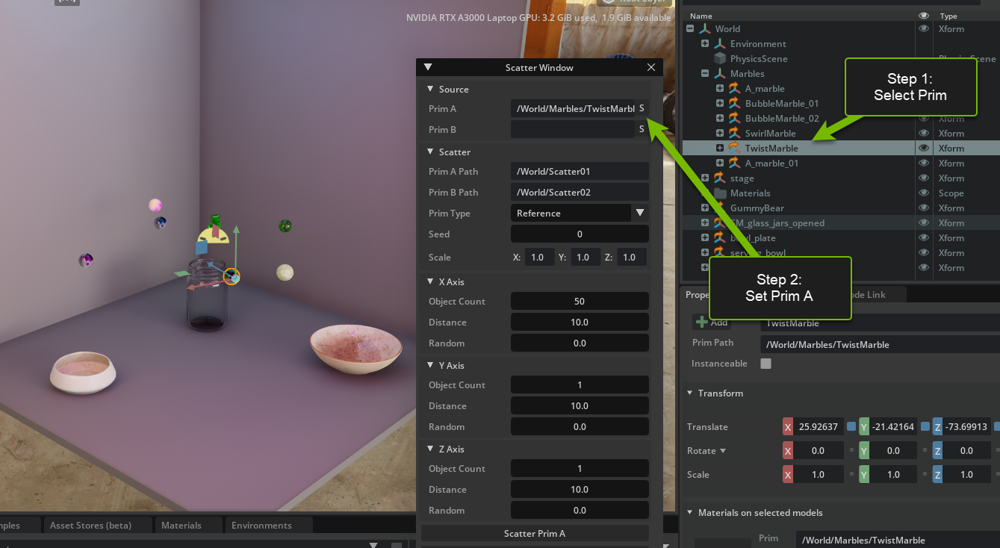

# NVIDIA OMNIVERSE

# 通过 NVIDIA Omniverse 为 3D 工具构建漂亮的自定义 UI 界面

亲自试用 NVIDIA Omniverse 套件中的 Omni.ui 工具及框架套件，深入了解其强大功能，从而成为用户界面大师。在本培训中，您将使用 Python 脚本在 Omniverse 中为工作流构建自定义用户界面。

# 学习目标
- 启用扩展程序 
- 使用 omni.ui 构建用户界面
- 创建列和行
- 创建按钮

<video width="560" height="315" controls>
  <source src="https://dli-lms.s3.amazonaws.com/assets/x-ov-05-v1-zh/BuildUIIntro_CN_v1.mp4" type="video/mp4">
</video>

# Omni.ui_Window Scatter

## 第 I 部分

<video width="560" height="315" controls>
  <source src="https://dli-lms.s3.amazonaws.com/assets/x-ov-05-v1-zh/BuildUISection1_CN_v1.mp4" type="video/mp4">
</video>

### <b>第 1 步：打开 Workshop Stage</b>

#### <b>第 1.1 步：从下面提供的链接下载 Stage</b>

[Stage的下载链接](https://dli-lms.s3.amazonaws.com/assets/x-ov-05-v1/Stage.zip)

#### <b>第 1.2 步：使用 “Extract All...”（提取所有文件...）解压 Stage</b>

此操作会创建一个名为 `Stage` 的解压文件夹。

#### <b>第 1.3 步：在 Omniverse 中打开 Stage</b>

在 Omniverse Code 的 `Content`（内容）选项卡中，找到系统中存放 Stage 文件的位置。
  
（即 C:/Users/yourName/Downloads/Stage）
 
在 Omniverse Code 控制台底部的 `Content` （内容）选项卡中，**双击**中间窗格中的 `Stage.usd`，即可在视图区中打开该 Stage。

### <b> 第 2 步：安装 Scatter 工具扩展功能</b>

#### <b>第 2.1 步：打开`Extensions`（扩展功能）选项卡</b>

单击 `Extensions`（扩展功能）管理器选项卡

#### <b>第 2.2 步：对来自社区或第三方的扩展功能进行筛选</b>

选择 `Community/Third Party`（社区/第三方）选项卡

<br>


<br>

#### <b>第 2.3 步：搜索 Scatter 工具</b>

搜索 `Scatter Tool`（散布工具），然后单击 `Omni.UI Window Scatter`


<br>

#### <b>第 2.4 步：安装/启用扩展功能</b>

单击选中的扩展功能，然后在右侧控制台中单击 `Install`（安装）。安装后，启用该扩展功能。

<span>&#10071;</span>您可能会收到一个警告，指明此扩展功能未经验证。安装此扩展功能是安全的。

<br>

启用此扩展功能后，屏幕上会显示 `Scatter Window`（散布窗口）。

 

<br>

#### <b>第 2.5 步：看到窗口了吗？ 设置来源</b>

在 `Viewport`（视图区）部分的 `Stage Hierarchy`（Stage 层次结构）中选择一个 prim （基元），然后按此方式在`Scatter Window`（散布窗口）中设置基元的来源：在 `Scatter Window`（散布窗口）中，单击`Source`（资源）下的`S`按钮。

`Prim`（基元）是 primitive 的简写，它是 Omniverse 中的基本单元。在 `USD` 中导入或创建的任何对象都是一个基元(prim)，例如照相机、声音、光线、网格等等。


<br>

#### <b>第 2.6 步：对基元执行散布操作</b>

在 X 轴上，以 30 为间距值散布 20 个对象。

在 Y 轴和 Z 轴上保留默认设置，然后单击 `Scatter Window`（散布窗口）底部的 `Scatter Prim A`（散布基元 A）。

此时，您的 Stage 应该与下面的示例相似：


><span>&#10067;</span>您注意到了吗？
>- 基元散布操作将在 Stage 的原点 `[0,0,0]` 执行。您有什么方法可以解决这个问题？
>- 您可以在 `Source`（来源）部分设置多个基元，但是无法对多个基元单独执行散布操作。我们将在第 II 部分解决这个问题。

<br>

### <b>第 3 步：启用物理效果</b>

找到 `Play`（播放）按钮并启用物理效果，看看会发生什么！物理效果播放完毕后，请记得单击 `Stop`（停止）按钮。

<details>
<summary>单击此处，查看 Play（播放）按钮所在的位置。</summary>


</details>

<br>

### <b>第 4 步：撤消散布操作</b>

在 `Stage` 中找到 `Scatter01` 文件夹并用左键单击该文件夹，然后单击鼠标右键选择“Delete”（删除）或按下键盘上的 `delete` 键。

`Stage`是一个面板，在上面您可以看到当前 `USD` (Universal Scene Description) 中的所有素材。它会按层次顺序列出所有的基元。

><span>&#10071;</span> 警告 <span>&#10071;</span>  如果使用 `ctrl+z` 组合键，则会撤消最后 3 项散布操作。


<br>

>### <span>&#129504;</span><b>第 5 步（自我挑战）：尽情想象用例</b>
><i>本培训中的所有自我挑战都是可选的。</i>
>
>思考此工具的 3 种使用方式。与同事进行头脑风暴，并思考如何将此工具应用于您所从事的行业！

<br>

>### <span>&#9940;</span> 建议在此处暂停，思考一下，再继续学习第 II 部分

<br>

## 第 II 部分

<video width="560" height="315" controls>
  <source src="https://dli-lms.s3.amazonaws.com/assets/x-ov-05-v1-zh/BuildUIIntroSection2_CN_v1.mp4" type="video/mp4">
</video>

<video width="560" height="315" controls>
  <source src="https://dli-lms.s3.amazonaws.com/assets/x-ov-05-v1-zh/BuildUISection2_CN_v1.mp4" type="video/mp4">
</video>

### <b> 第 6 步：向用户界面添加其他来源</b>

#### <b>第 6.1 步：打开 Visual Studio</b>

转至 `Extensions`（扩展功能）选项卡，然后单击 `Scatter Window`（散布窗口）扩展功能，以在右侧打开扩展功能的概览。单击文件夹图标旁边的 `VS Code` 图标：


<br>

#### <b>第 6.2 步：找到窗口脚本</b>

在以下位置找到本培训需要使用的文件：

 `exts -> omni\example\ui_scatter_tool`

我们将使用 

`window.py`

<br>


<br>

#### <b>第 6.3 步：找到模型</b>

在 `ScatterWindow` 类的顶部，找到 `Models`（模型）代码集。

此代码集定义了基元 A 的来源和散布属性。


<br>

#### <b>第 6.4 步：在模型代码集中添加基元模型 B</b>

在 `Models`（模型）代码集的 `self._scatter_prim_model_a` 下方，添加新基元 `prim model b` 的来源和散布属性，具体如下：

```python
        self._source_prim_model_b = ui.SimpleStringModel()
        self._scatter_prim_model_b = ui.SimpleStringModel()
```

><span>&#10071;</span>  确保代码正确对齐。编辑后的 `Models` 部分将与以下示例类似：


<br>


#### <b>第 6.5 步：找到默认设置</b>

在 `Models`（模型）代码集下面，找到 `Defaults`（默认设置）代码集。

这是将要在 `Stage`中执行的散布操作的默认名称。


<br>

#### <b>第 6.6 步：为基元模型 B 添加默认设置</b>

在 `self._scatter_prim_model_a._as_string` 属性下方，为 `prim model b` 设置相同的属性，但是将其在场景中的路径定义为 `/World/Scatter02`。这将决定在 `Stage`中对基元 B 执行散布操作的默认位置。

```python
        self._scatter_prim_model_b.as_string = "/World/Scatter02"
```

此时，您的 `Defaults`（默认设置）部分应该与下面的示例相似：


<br>

#### <b>第 6.7 步：找到 _build_source 函数</b>

在同一脚本中，找到 `_build_source` 函数。


此函数用于为 `Scatter Window`（散布窗口）中`Source`（来源）选项（即单击“S”按钮设置所选基元的功能）创建用户界面。

<br>

#### <b>第 6.8 步：为基元 B 添加来源用户界面</b>

在这个函数的底部，将下面的新 `ui.HStack` 添加到原有的基元 A 的 `ui.HStack` 下方。


```python
                with ui.HStack():
                    ui.Label("Prim B", name="attribute_name", width=self.label_width)
                    ui.StringField(model=self._source_prim_model_b)
                    # Button that puts the selection to the string field
                    ui.Button(
                        " S ",
                        width=0,
                        height=0,
                        style={"margin": 0},
                        clicked_fn=lambda:self._on_get_selection(self._source_prim_model_b),
                        tooltip="Get From Selection",
                    )
```

此时，更新后的函数应该与下面的示例相似：


<br>

保存更改后的 `window.py` 脚本，然后查看`Scatter Window`（散布窗口）的用户界面是否相应更新。


## <span>&#127881;</span> 恭喜！ <span>&#127881;</span>

您在 Omniverse 中创建了自己的第一个用户界面组件！


<br>

><span>&#10067;</span>  如果用户界面没有更新或者 `Scatter Window`（散布窗口）消失了，请在控制台中检查代码是否有误。`Console`（控制台）选项卡位于此处：
>
>

<br>

><span>&#10071;</span>  造成这些问题的一个常见错误是代码没有正确对齐。请检查代码缩进格式是否与第 6.8 步中的屏幕截图完全相同。

<br>

#### <b>第 6.9 步：找到 _build_scatter 函数</b>

在 `window.py` 中，找到 `_build_scatter` 函数。

此函数用于为 `Scatter Window`（散布窗口）中 `Source`（资源）下的散布组创建用户界面。


<br>

#### <b>第 6.10 步：为基元 B 添加散布工具用户界面</b>

使用如下代码，在 `Prim A Path` 行的下面，为 `Prim B Path` 创建新的 `ui.HStack`：

```python
                with ui.HStack():
                    ui.Label("Prim B Path", name="attribute_name", width=self.label_width)
                    ui.StringField(model=self._scatter_prim_model_b)
              
```


此时，您的 `_build_scatter` 应该与下面的示例相似：


<br>

保存更改后的 `window.py` 脚本，然后查看 Omniverse 中的用户界面是否相应更新。

## <span>&#127775;</span> 太棒了！ <span>&#127775;</span>

您又一次成功创建了用户界面！


<br>

#### <b>第 6.11 步：找到 _build_fn 函数</b>

在 `window.py`中，找到函数 `_build_fn`。

此函数用于构建整个 `Scatter Window`（散布窗口）的用户界面，它还会调用单击 `Scatter Prim`（散布基元）按钮时触发的函数。


<br>

#### <b>第 6.12 步：为基元 B 添加散布按钮</b>

在 `Prim A`（基元 A）的 `Go`（执行）按钮下面，创建这个新按钮。

```python
                # “Go”（执行）按钮
                ui.Button("Scatter Prim B", clicked_fn=lambda:self._on_scatter(self._source_prim_model_b, self._scatter_prim_model_b))
```

此时，您的 `_build_fn` 应该与下面的示例相似：


<br>

保存 `window.py`，然后查看 Omniverse 中的用户界面是否相应更新。

## <span>&#10024;</span> 太赞了！ <span>&#10024;</span>

您创建了一个新按钮，做的好！


<br>

### <b> 第 7 步：设置基元 A 和基元 B 并执行散布操作</b>

#### <b>第 7.1 步：设置基元 A 和基元 B 的来源</b>

按照第 2.5 步的操作，为基元 A 和基元 B 设置来源。



<br>

在设置基元 B 时，务必使用与基元 A 不同的基元。

例如，将基元 A 设置为 “TwistMarble”，将基元 B 设置为 “GummyBear”。


<br>

#### <b>第 7.2 步：为 X 轴、Y 轴和 Z 轴设置参数</b>

将 X 轴的 “Object Count”（对象数量）和 “Distance”（距离）分别设置为 5 和 25。

将 Y 轴的 “Object Count”（对象数量）和 “Distance”（距离）分别设置为 4 和 25。

将 Z 轴的 “Object Count”（对象数量）和 “Distance”（距离）分别设置为 4 和 25。


<br>

#### <b>第 7.3 步：对基元 A 执行散布操作</b>

单击 `Scatter Prim A`（散布基元 A）按钮。

屏幕上将会显示一个由基元 A 组成的正方形，而且 `Stage` 里会出现一个名为 `Scatter01` 的文件夹。

选择该文件夹中的第一个基元，再<b>按住 Shift 键单击</b>该文件夹中的最后一个基元，以选择 `Scatter 01` 中的所有基元。然后在视图中，将基元方阵移动到大碗的上方。


<br>

#### <b>第 7.4 步：对基元 A 执行散布操作</b>

单击`Scatter Prim B`（散布基元 B）按钮。

屏幕上将会显示一个由基元 B 组成的正方形，而且 `Stage` 中会出现一个名为 `Scatter 02` 的文件夹。

将这些基元留在原位。


<br>

#### <b>第 7.5 步：按下 `Play`（播放）按钮</b>

按下 `Play`（播放）按钮，观看基元掉入碗和瓶中！

完成后，按下 `Stop`（停止）按钮。


<br>

>### <span>&#129504;</span><b>第 8 步（自我挑战）：在用户界面中设置范围参数</b>
><i>本培训中的所有自我挑战都是可选的。</i>
>
>代码中已经包含了用于确定基元散布范围的函数，您能为它创建相应的用户界面吗？
>
><b>提示：</b>请在 `_build_scatter` 中进行构建。
>
>[您可以在此处搜索 omni.ui 文档。](https://docs.omniverse.nvidia.com/py/kit/source/extensions/omni.ui/docs/index.html#omni.ui.StringField)
>
><details>
><summary> 单击此处获取答案 </summary>
>
>### 第 8.1 步（自我挑战）：为范围功能构建用户界面
><i>本培训中的所有自我挑战都是可选的</i>
>
>按照第 6.9 步的操作，在 `window.py` 中找到 `_build_scatter`。
>
>将下面几行用于范围功能的代码添加到函数底部：
>
>```python
>                with ui.HStack():
>                    ui.Label("Scale", name="attribute_name", width=self.label_width)
>                    for field in zip(["X:", "Y:", "Z:"], self._scale_models):
>                        ui.Label(field[0], width=0, style={"margin": 3.0})
>                        ui.FloatField(model=field[1], height=0, style={"margin": 3.0})
>```
>
>此时，您的 `_build_scatter` 函数应该与下面的示例相似：
>
>
>
>保存 `window.py`，然后查看 Omniverse 中的用户界面是否相应更新。
>
>新用户界面应如下图所示：
>
>
>
>设置新的范围和对象数量参数，然后单击 `Scatter Prim A`（散布基元 A），看看是否有效。
>
></details>

<br>


>### <span>&#9940;</span> 建议在此处暂停，思考一下，再继续学习第 III 部分

<br>

##  第 III 部分

<video width="560" height="315" controls>
  <source src="https://dli-lms.s3.amazonaws.com/assets/x-ov-05-v1-zh/BuildUISection3_CN_v1.mp4" type="video/mp4">
</video>

### <b> 第 9 步：制作您自己的场景</b>

#### <b>第 9.1 步：尝试不同的参数</b>

使用多组不同的 X 轴、Y 轴和 Z 轴对象数量和距离参数，对基元执行散布操作。

#### <b>第 9.2 步：使用随机参数</b>

更改各个轴的 `Random`（随机）参数值，然后再次对基元执行散布操作。

`Random`（随机）参数有什么作用？
在`Scatter Tool`（散布工具）中，`Random`（随机）参数是一个标量因子，系统会用它乘以一个随机值，并将计算结果添加到每个对象的均匀分布值上。

例如：如果 `Distance`（距离）参数设置为 20，每个对象将被分配 0、20、40...（以此类推）的距离值。如果添加一个 15 左右的`Random`（随机）参数 ，则各个对象的距离值会变为 0 + (15 * random_number_gen)、20 + (15 * random_number_gen) 等等。

>&#128161;  完成设置后，按下`Play`（播放）按钮
>
>

>### <span>&#129504;</span><b>第 10 步（自我挑战）：瓶和碗里会有多少块大理石？</b>
>
><i>本培训中的所有自我挑战都是可选的。</i>
>
>您如何使用缩放工具，让尽可能多的大理石掉落到瓶和碗里？
>
><details>
><summary>单击此处查看建议</summary>
>
>与第 7.2 步类似，在对基元执行散布操作时，只需使用较小的`Distance`（距离）值，并设置较大的`Object Count`（对象数量）值来创建大量基元，然后将其移动到瓶或碗的上方，再按下`Play`（播放）键，观看基元落下即可！
>
>
>
></details>

<br>

## 恭喜！
您已完成本培训！希望您在学习和使用 Omniverse 的过程中找到乐趣！

[欢迎在 Discord 上加入我们，进行更深入的交流！](https://discord.com/invite/nvidiaomniverse)


