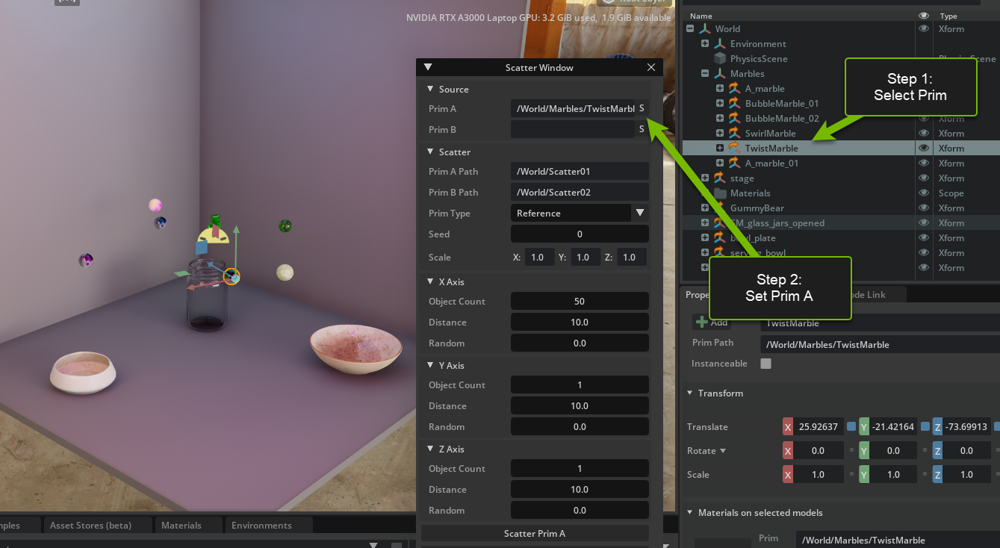

# NVIDIA OMNIVERSE
# Build Beautiful, Custom UI for 3D Tools on NVIDIA Omniverse​

Become a master in UI with a hands-on deep dive into NVIDIA Omniverse Kit’s powerful omni.ui suite of tools and frameworks. In this session, you’ll build your own custom UI for workflows in Omniverse with Python script.

# Learning Objectives
- Enable Extension 
- Build with omni.ui
- Create Columns and Rows
- Create a button

<video width="560" height="315" controls>
  <source src="https://d36m44n9vdbmda.cloudfront.net/assets/x-ov-05-v1/BuildUIIntro.mp4" type="video/mp4">
</video>

# Omni.ui_Window Scatter

## Section I

<video width="560" height="315" controls>
  <source src="https://d36m44n9vdbmda.cloudfront.net/assets/x-ov-05-v1/BuildUISection1.mp4" type="video/mp4">
</video>

### Step 1: Open the Workshop Stage

#### <b>Step 1.1: Download the Stage from the Link Provided</b>

[Stage Link](https://dli-lms.s3.amazonaws.com/assets/x-ov-05-v1/Stage.zip)

#### <b> Step 1.2: Unzip Stage Using Extract All...

This creates an unzipped file folder called `Stage`.

#### <b> Step 1.3: Open Stage in Omniverse

Navigate inside Omniverse Code's `Content tab` to the stage file's location on your system.
  
(i.e. C:/Users/yourName/Downloads/Stage)
 
**Double Click** `Stage.usd` in the center window pane of the `Content tab` at the bottom of the Omniverse Code Console and it will appear in the viewport.


### Step 2: Install the Scatter Tool Extension
#### <b>Step 2.1: Open the Extensions Tab</b>

Click on `Extensions` Manager Tab 

#### <b>Step 2.2: Filter by Commnuity Extension</b>

Select `Community` tab

<br>


<br>

#### <b>Step 2.3: Search for Scatter Tool</b>

Search for `Scatter Tool` and click on `Omni.UI Window Scatter`


<br>

#### <b>Step 2.4: Install/Enable the Extension</b>

Click on the extension and then click `Install` in the right console. Once installed, enable the extension. 

<span>&#10071;</span> You may get a warning that this extension is not verified. It is safe to install this extension.

<br>

`Scatter Window` will appear on the screen when the extension is enabled.

 

<br>

#### <b>Step 2.5: Does it work? Set the Source</b>

In the `Viewport` select a prim in the `Stage Hierarchy` and then set the Source of the prim in the Scatter Window by clicking the "S" in Source of `Scatter Window` .

A `prim` is short for primitive. The prim is the fundamental unit in Omniverse. Anything imported or created in a `USD`, Universal Scene Description, scene. This includes camera, sounds, lights, meshes, etc. 


<br>

#### <b>Step 2.6: Scatter the Prim</b>

Scatter 20 objects on the `X-axis` with a distance of 30. 

Leave Y and Z at default and then click `Scatter Prim A` at the bottom of the `Scatter Window`.

Here is an example of what your scene may look like:


><span>&#10067;</span>Did you notice?
>- Prim scatters at World Origin `[0,0,0]`. How do you think this can be fixed?
>- You can set multiple prim's in the Source but you cannot scatter multiple prim's individually, which we will fix in Section II!

<br>

#### <b>Step 3: Enable Physics</b>

Find the `Play` button and enable physics, watch what happens! Don't forget to hit the `Stop` button after the physics have played.

<details>
<summary>Click here to see where the play button is located</summary>


</details>

<br>

### <b>Step 4: Undo Scatter</b>

Find the `Scatter01` folder in `Stage` and left-click on the folder then right-click to delete or hit the `delete` button on your keyboard. 

`Stage` is the panel that allows you to see all the assets in your current `USD`, or Universal Scene Description. It lists the prims in heirarchical order.

><span>&#10071;</span> Warning <span>&#10071;</span>  If you `ctrl+z` you will undo the last 3 scatters.


<br>

>#### <span>&#129504;</span><b>Challenge Step 5: Brainstorm Use Cases</b>
><i>All Challenges in this workshop are optional</i>
>
>Think of 3 ways this tool could be used. Brain storm with your peers and think of how it can be used for your industry!

<br>

>### <span>&#9940;</span> Stop here and wait to move on to Section II

<br>

## Section II

<video width="560" height="315" controls>
  <source src="https://d36m44n9vdbmda.cloudfront.net/assets/x-ov-05-v1/BuildUIIntroSection2.mp4" type="video/mp4">
</video>

<video width="560" height="315" controls>
  <source src="https://d36m44n9vdbmda.cloudfront.net/assets/x-ov-05-v1/buildUISection2.mp4" type="video/mp4">
</video>

### Step 6: Add another Source to the UI

#### <b>Step 6.1: Open Visual Studio</b>

Go to the `Extensions` tab and click the `Scatter Window` extension to open the extension overview to the right. Click the `VS Code` icon next to the folder icon:


<br>

#### <b>Step 6.2: Locate Window Script</b>

Locate the files you need for this session at:

 `exts -> omni\example\ui_scatter_tool`

You are working in

`window.py`

<br>


<br>

#### <b>Step 6.3: Locate Models</b>

Locate the sets of `Models` at the top of the `ScatterWindow` class.

This is where prim A is defined for both the source and the scatter properties. 


<br>

#### <b>Step 6.4: Add Prim Model B to Models</b>

Below `self._scatter_prim_model_a` in the sets of `Models`, add the source and scatter for our new prim, `prim model b`, as so:

```python
        self._source_prim_model_b = ui.SimpleStringModel()
        self._scatter_prim_model_b = ui.SimpleStringModel()
```

><span>&#10071;</span>  Check that you have tabbed correctly. Your new `Models` section should look like this:


<br>


#### <b>Step 6.5: Locate Defaults</b>

Locate the sets of `Defaults` below the sets of `Models`.

This is the default name for the scatter that will be nested in `Stage`.


<br>

#### <b>Step 6.6: Add Default for Prim Model B </b>

Below the property for `self._scatter_prim_model_a._as_string`, set the same for `prim model b` but instead, define the path in the stage as `/World/Scatter02`. This will default where the scatter for prim b will be nested in `Stage`. 

```python
        self._scatter_prim_model_b.as_string = "/World/Scatter02"
```

Now your `Defaults` section should look like this:


<br>

#### <b>Step 6.7: Locate _build_source function</b>

Locate `_build_source` function in the same script.


This function creates the UI for the `Source` of `Scatter Window` where you set the selected prim by clicking the "S". 

<br>

#### <b>Step 6.8: Add Source UI for Prim B</b>

Add this new `ui.HStack` to the bottom of this function, underneath the existing `ui.HStack` for Prim A. 


```python
                with ui.HStack():
                    ui.Label("Prim B", name="attribute_name", width=self.label_width)
                    ui.StringField(model=self._source_prim_model_b)
                    # Button that puts the selection to the string field
                    ui.Button(
                        " S ",
                        width=0,
                        height=0,
                        style={"margin": 0},
                        clicked_fn=lambda:self._on_get_selection(self._source_prim_model_b),
                        tooltip="Get From Selection",
                    )
```

So that your updated function looks like this:


<br>

Save your `window.py` script and check that your Scatter Window UI updated.


## <span>&#127881;</span> CONGRATULATIONS! <span>&#127881;</span>

You have created your first piece of UI in Omniverse!


<br>

><span>&#10067;</span>  If your UI did not update or your `Scatter Window` disappeared, check the console for errors. The `Console` tab can be found here:
>
>

<br>

><span>&#10071;</span>  A common error may be that your code is not aligned properly. Check that the indents match the snippets in step 6.8.

<br>

#### <b>Step 6.9: Locate _build_scatter Function</b>

Locate the function `_build_scatter` in `window.py`.

This function creates the UI for the Scatter group below `Source` in `Scatter Window`. 


<br>

#### <b>Step 6.10: Add Scatter UI for Prim B</b>

Create this new `ui.HStack`, for `Prim B Path` below the row for `Prim A Path` as follows:

```python
                with ui.HStack():
                    ui.Label("Prim B Path", name="attribute_name", width=self.label_width)
                    ui.StringField(model=self._scatter_prim_model_b)
              
```


So now your `_build_scatter` looks like this:


<br>

Save your `window.py` script and check that your UI has updated in Omniverse.

## <span>&#127775;</span> AMAZING! <span>&#127775;</span>

You've done it again and successfully created UI!


<br>

#### <b>Step 6.11: Locate _build_fn Function</b>

Locate the function `_build_fn` in `window.py`

This function builds the entire UI in the `Scatter Window` and also calls the function for when the `Scatter Prim` button is clicked.


<br>

#### <b>Step 6.12: Add a scatter button for Prim B</b>

Create this new button underneath the `Go Button` for `Prim A`.  

```python
                # The Go button
                ui.Button("Scatter Prim B", clicked_fn=lambda:self._on_scatter(self._source_prim_model_b, self._scatter_prim_model_b))
```

So your `_build_fn` should look like this:


<br>

Save `window.py` and check that your UI has been updated in Omniverse.

## <span>&#10024;</span> WOW! <span>&#10024;</span>

You've created a new button, great job!


<br>

### Step 7: Set and Scatter Prim A and Prim B
#### <b>Step 7.1: Set the Source of Prim A and Prim B</b>

Set the Source for Prim A and Prim B, just as you did in Step 2.5 




<br>

Make sure that you have set Prim B as a different Prim than Prim A.

For example, set Prim A as Twist Marble and set Prim B as Gummy Bear.


<br>

#### <b>Step 7.2: Set Parameters for X, Y, Z Axis</b>

Set X axis object count to 5 with a distance of 25.

Set Y axis object count to 4 with a distance of 25.

Set Z axis object count to 4 with distance of 25.


<br>

#### <b>Step 7.3: Scatter Prim A</b>

Click Scatter Prim A button. 

You should see a quad of Prim A appear on the screen and a folder in `Stage` labeled `Scatter01`.

Select the prims in `Scatter 01` by selecting the first prim in the folder and then <b>shift+click</b> the last prim in the folder then move the quad of Prims over the serving bowl in the viewport.


<br>

#### <b>Step 7.4: Scatter Prim B</b>

Click Scatter Prim B button.

You should see a quad of Pim B appear on the screen and a folder in `Stage` labeled `Scatter 02`.

Leave these prims where they originated. 


<br>

#### <b>Step 7.5: Press the Play Button</b>

Press `Play` and watch the Prims fall into the bowl and jar!

Press `Stop` when you are done.


<br>

>#### <span>&#129504;</span><b>Challenge Step 8: Set Scale Parameters in the UI</b>
><i>All Challenges in this workshop are optional</i>
>
>The function to scale the prim on scatter already exists in the code, can you create the UI for it? 
>
><b>Hint:</b> It will be built in `_build_scatter`. 
>
>[You can search the omni.ui documentation here.](https://docs.omniverse.nvidia.com/py/kit/source/extensions/omni.ui/docs/index.html#omni.ui.StringField)
>
><details>
><summary> Click here for the answer </summary>
>
>### Challenge Step 8.1: Build UI for Scale
><i>All Challenges in this workshop are optional</i>
>
>Locate `_build_scatter` in `window.py` as we did in step 6.9.
>
>Add this new row for Scale at the bottom of the function:
>
>```python
>                with ui.HStack():
>                    ui.Label("Scale", name="attribute_name", width=self.label_width)
>                    for field in zip(["X:", "Y:", "Z:"], self._scale_models):
>                        ui.Label(field[0], width=0, style={"margin": 3.0})
>                        ui.FloatField(model=field[1], height=0, style={"margin": 3.0})
>```
>
>So now your `_build_scatter` function should look like this:
>
>
>
>Save `window.py` and check that the UI has updated in Omniverse.
>
>This is what your new UI should look like:
>
>
>
>Check that it is working by setting new parameters for scale and object count then click `Scatter Prim A`. 
>
></details>

<br>


>### <span>&#9940;</span> Stop here and wait to move on to Section III

<br>

##  Section III

<video width="560" height="315" controls>
  <source src="https://d36m44n9vdbmda.cloudfront.net/assets/x-ov-05-v1/buildUISection3.mp4" type="video/mp4">
</video>

### Step 9: Make your scene

#### <b>Step 9.1: Play with the Parameters</b>

Scatter your prims using various object and distance parameters along the X, Y, and Z axis. 

#### <b>Step 9.2: Randomize your Parameters</b>

Scatter your prims again changing the `Random` parameters along the different axis. 

What does Random do?
The `Random` parameter in `Scatter Tool` is a scalar factor that multiples against a random number and is then added to the uniform distribution for each object.

For example: If the `Distance` parameter is set to 20, each other be would distanced at 0, 20, 40, etc. If you add a `Random` parameter of 15 then it turns into 0 = (15 * random_number_gen), 20 + (15 * random_number_gen), etc.

>:bulb:Press play when you are finished
>
>

>#### <span>&#129504;</span><b>Challenge Step 10: How many marbles can you get in the jars and bowls?</b>
>
><i>All Challenges in this workshop are optional</i>
>
>How can you use the scatter tool to drop as many marbles into the jars and bowls?
>
><details>
><summary>Click here for a suggestion</summary>
>
>Similar to Step 7.2, scatter a Prim in a smaller distance and higher object count to create a large stack of prims then move over a jar or bowl before pressing play. Then watch them all fall!
>
>
>
></details>

<br>

## Congratulations! 
You have completed this workshop! We hope you have enjoyed learning and playing in Omniverse!

[Join us on Discord to extend the conversation!](https://discord.com/invite/nvidiaomniverse)
