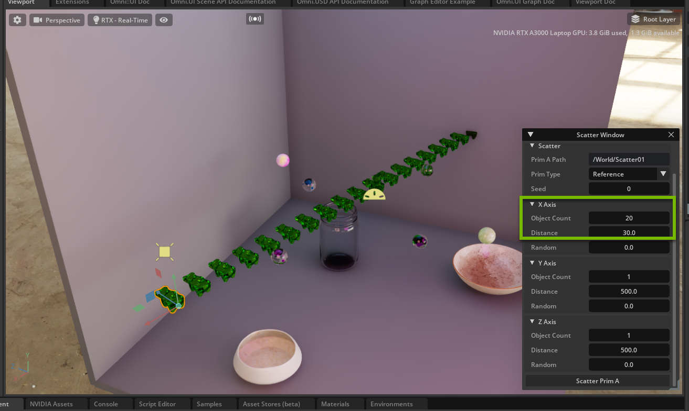
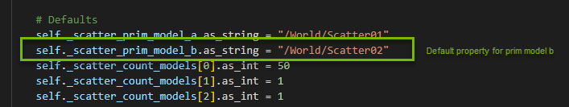

# NVIDIA OMNIVERSE
# Build Beautiful, Custom UI for 3D Tools on NVIDIA Omniverse​

Become a master in UI with a hands-on deep dive into NVIDIA Omniverse Kit’s powerful omni.ui suite of tools and frameworks. In this session, you’ll build your own custom UI for workflows in Omniverse with Python script.

# Learning Objectives
- Enable Extension 
- Build with omni.ui
- Create Columns and Rows
- Create a button

# Omni.ui_Window Scatter

## Section I

### Step 1: Open the Workshop Stage

>#### <b>Step 1.1: Open the Bookmarks tab</b>

Find the `Content` tab at the bottom of the Omniverse Code Console and locate the `Bookmarks` drop down.

>#### <b>Step 1.2: Get Our Project File</b>
In the dropdown,
-  locate the `Siggraph2022_Stage` folder. 

- Open the `Workshop_Custom_UI` folder.

- Open `Siggraph2022_Stage.usd`

<br>


<br>


### Step 2: Install the Scatter Tool Extension
> #### <b>Step 2.1: Open the Extensions Tab</b>
Click on `Extensions` Manager Tab 

>#### <b>Step 2.2: Filter by Commnuity Extension</b>

Select `Community` tab
<br>


<br>

>#### <b>Step 2.3: Search for Scatter Tool</b>

Search for `Scatter Tool` and click on `omni.example.ui_scatter_tool`

>#### <b>Step 2.4: Install/Enable the Extension</b>

Click on the extension and then click `Install` in the right console. Once installed, enable the extension. 

>:exclamation: You may get a warning that this extension is not verified. It is safe to install this extension.

<br>

`Scatter Window` will appear on the screen when the extension is enabled.


<br>

>#### <b>Step 2.5: Does it work? Scatter a Prim!</b>
In the `Viewport` select a prim, or object, in the `Stage Hierarchy` and then set the Source of the prim in the Scatter Window by hitting the "S" Button.


Scatter 20 objects on the X-axis with a distance of 30. Leave Y and Z at default and then click `Scatter Prim A` at the bottom of the `Scatter Window`.

Here is an example of what your scene may look like:



>:question:Did you notice?
>- Prim scatters at World Origin `[0,0,0]`. How do you think this can be fixed?
>- You can set multiple prim's in the Source but you cannot scatter multiple prim's individually, which we will fix in Section II!

<br>

>### <b>Step 3: Enable Physics</b>
Find the `Play` button and enable physics, watch what happens! Don't forget to hit the `Stop` button after the physics have played.

<details>
<summary>Click here to see where the play button is located</summary>


</details>

<br>

>#### :bell:<b>Challenge Step 4: Brainstorm Use Cases</b>
>Think of 3 ways this tool could be used. Brain storm with your peers and think of how it can be used for your industry!

<br>

>### :no_entry_sign: Stop here and wait to move on to Section II

<br>

## Section II

### Step 5: Add another Source to the UI

>#### <b>Step 5.1: Open Visual Studio</b>

Go to the `Extensions` tab and click the `Scatter Window` extension to open the extension overview to the right. Click the `VS Code` icon next to the folder icon:


<br>

>#### <b>Step 5.2: Locate Window Script</b>

Locate the files you need for this session at:

 `exts -> omni/example/ui_scatter_tool`

You are working in

`window.py`

<br>


<br>

>#### <b>Step 5.3: Create Prim B Model</b>

In `ScatterWindow` class there are sets of `Models` where prim A is defined for both the source and the scatter properties. 

Below `self._scatter_prim_model_a`, set the source and scatter for our new prim, `prim model b`, as so:

```python
        self._source_prim_model_b = ui.SimpleStringModel()
        self._scatter_prim_model_b = ui.SimpleStringModel()
```

>:exclamation: Check that you have tabbed correctly. Your new `Models` section should look like this:


<br>


>#### <b>Step 5.4: Create Default String for Prim B </b>

Below the sets of `Models`, there are sets of `Defaults`. Below the property for `self._scatter_prim_model_a._as_string`, set the same for `prim model b` but instead, define the path in the stage as `/World/Scatter02`. This will default where the scatter for prim b will be nested in `Stage`. 

```python
        self._scatter_prim_model_b.as_string = "/World/Scatter02"
```

Now you `Defaults` section should look like this:


>### Step 5.5: Create the Source UI

Locate `_build_source` function in the same script.

This function creates the Source UI in the `Scatter Window` using omni.ui to create a column, `ui.VStack`, and rows, `ui.HStack`, as well as the button to set the selection, `ui.Button`. 

Create a new row, with `ui.Hstack`, for `Prim B` underneath the row for `Prim A`, as so:

```python
    def _build_source(self):
        """Build the widgets of the "Source" group"""
        with ui.CollapsableFrame("Source", name="group"):
            with ui.VStack(height=0, spacing=SPACING):
                with ui.HStack():
                    ui.Label("Prim A", name="attribute_name", width=self.label_width)
                    ui.StringField(model=self._source_prim_model_a)
                    # Button that puts the selection to the string field
                    ui.Button(
                        " S ",
                        width=0,
                        height=0,
                        style={"margin": 0},
                        clicked_fn=lambda:self._on_get_selection(self._source_prim_model_a),
                        tooltip="Get From Selection",
                    )
    
                with ui.HStack():
                    ui.Label("Prim B", name="attribute_name", width=self.label_width)
                    ui.StringField(model=self._source_prim_model_b)
                    # Button that puts the selection to the string field
                    ui.Button(
                        " S ",
                        width=0,
                        height=0,
                        style={"margin": 0},
                        clicked_fn=lambda:self._on_get_selection(self._source_prim_model_b),
                        tooltip="Get From Selection",
                    )
```

<br>

Save your `window.py` script and check that your UI in Omniverse updated.

This is what your new UI should look like:


<br>

>:question: If your UI did not update or your `Scatter Window` disappeared, check the console for errors. The `Console` tab can be found here:
>
>

<br>

>### <b>Step 5.6: Create Scatter UI</b>

Locate the function `_build_scatter` in `window.py`.

This function creates the UI for the Scatter group below `Source` in `Scatter Window`. 

Create the row, using `ui.HStack`, for `Prim B Path` below the row for `Prim A Path` as follows:

```python
    def _build_scatter(self):
        """Build the widgets of the "Scatter" group"""
        with ui.CollapsableFrame("Scatter", name="group"):
            with ui.VStack(height=0, spacing=SPACING):
                with ui.HStack():
                    ui.Label("Prim A Path", name="attribute_name", width=self.label_width)
                    ui.StringField(model=self._scatter_prim_model_a)
    
                with ui.HStack():
                    ui.Label("Prim B Path", name="attribute_name", width=self.label_width)
                    ui.StringField(model=self._scatter_prim_model_b)
              
```

<br>

Save your `window.py` script and check that your UI has updated in Omniverse.

This is what your new UI should look like:


<br>

>### <b>Step 5.7: Create the Go button for Prim B</b>

Locate the function `_build_fn` in `window.py`

This function builds the entire UI in the `Scatter Window` and also calls the function for when the `Scatter Prim` button is clicked.

We have a button for `Scatter Prim A` already.

Create a new button below it to `Scatter Prim B`.

```python
    def _build_fn(self):
        """
        The method that is called to build all the UI once the window is
        visible.
        """
        with ui.ScrollingFrame():
            with ui.VStack(height=0):
                self._build_source()
                self._build_scatter()
                self._build_axis(0, "X Axis")
                self._build_axis(1, "Y Axis")
                self._build_axis(2, "Z Axis")

                # The Go button
                ui.Button("Scatter Prim A", clicked_fn=lambda:self._on_scatter(self._source_prim_model_a, self._scatter_prim_model_a))
                
    
                # The Go button
                ui.Button("Scatter Prim B", clicked_fn=lambda:self._on_scatter(self._source_prim_model_b, self._scatter_prim_model_b))
```

<br>

Save `window.py` and check that your UI has been updated in Omniverse.

This is what your new UI should look like:


<br>

>#### :bell:<b>Challenge Step 6: Set Scale Parameters in the UI</b>
>
>Can you add the option to set the scale in `Scatter Window`?
>
><details>
><summary> Click here for the answer </summary>
>
>### Challenge Step 6.1: Set new variables
>Set new variables for scale in `Models` and  `Defaults` of the `ScatterWindow` class of `window.py`
>
>```python
>        # Models
>        self._source_prim_model_a = ui.SimpleStringModel()
>        self._scatter_prim_model_a = ui.SimpleStringModel()
>        self._source_prim_model_b = ui.SimpleStringModel()
>        self._scatter_prim_model_b = ui.SimpleStringModel()
>        self._scatter_type_model = ComboBoxModel("Reference", "Copy", "PointInstancer")
>        self._scatter_seed_model = ui.SimpleIntModel()
>        self._scatter_count_models = [ui.SimpleIntModel(), ui.SimpleIntModel(), ui.SimpleIntModel()]
>        self._scatter_distance_models = [ui.SimpleFloatModel(), ui.SimpleFloatModel(), ui.SimpleFloatModel()]
>        self._scatter_random_models = [ui.SimpleFloatModel(), ui.SimpleFloatModel(), ui.SimpleFloatModel()]
>        
>        self._scale_models = [ui.SimpleFloatModel(), ui.SimpleFloatModel(), ui.SimpleFloatModel()]
>        
>        
>
>        # Defaults
>        self._scatter_prim_model_a.as_string = "/World/Scatter01"
>        self._scatter_prim_model_b.as_string = "/World/Scatter02"
>        self._scatter_count_models[0].as_int = 50
>        self._scatter_count_models[1].as_int = 1
>        self._scatter_count_models[2].as_int = 1
>        self._scatter_distance_models[0].as_float = 500
>        self._scatter_distance_models[1].as_float = 500
>        self._scatter_distance_models[2].as_float = 500
>       
>        self._scale_models[0].as_float = 1
>        self._scale_models[1].as_float = 1
>        self._scale_models[2].as_float = 1
>        
>```
>
>### Challenge Step 6.2: Add scale in _on_scatter
>Locate the function `_on_scatter`.
>
>Add scale parameters to `duplicate_prims` as so:
>
>```python
>        duplicate_prims(
>            transforms=transforms,
>            prim_names=prim_names,
>            target_path=scatter_model.as_string,
>            mode=self._scatter_type_model.get_current_item().as_string,
>            
>            scale=[self._scale_models[0].as_float, self._scale_models[1].as_float, self._scale_models[2].as_float]
>            
>        )
>```
>
>Save `window.py`.
>
>### Challenge Step 6.3: Create the logic in utils.py
>Navigate to script `utils.py` in the same file location as `window.py`.
>
>### Challenge Step 6.4: Add to duplicate_prims Function
>Locate `duplicate_prims` function in `utils.py`. 
>
>Add scale to the parameters as so:
>
>```python
>def duplicate_prims(transforms: List = [], prim_names: List[str] = [], target_path: str = "", mode: str = "Copy", >scale: List[float] = [1,1,1]):
>
>```
>
>###  Challenge Step 6.5: Create New Execture Parameters and Varaibles
>Locate `omni.kit.commands.execute` call at the bottom of the script. 
>
>Above this call set new variables for stage, prim, trans_matrix, and new_transform.
>
>```python
>            ### ADD THESE NEW VARIABLES ###
>            stage = usd_context.get_stage()
>            prim = stage.GetPrimAtPath(path_to)
>            trans_matrix = matrix[3]
>            new_transform = Gf.Vec3d(trans_matrix[0], trans_matrix[1], trans_matrix[2])
>            ## END
>
>            omni.kit.commands.execute("TransformPrim", path=path_to, new_transform_matrix=matrix)
>            
>```
>
>Next, edit and add to the parameters in `omni.kit.commands.exectue`, like so:
>
>```python
>            omni.kit.commands.execute("TransformPrimSRT", path=path_to, new_translation=new_transform, >new_scale=scale)
>```
>
>### Challenge Step 6.6: New Gf Import
>Locate the imports at the top of `utils.py` add the new Gf import:
>
>```python
>from typing import List
>import omni.usd
>import omni.kit.commands
>from pxr import Sdf
>
>from pxr import Gf
>
>```
>
>Save `utils.py`
>
>### Challenge Step 6.7: Build UI for Scale
>Locate `_build_scatter` in `window.py`.
>
>Add a new row, using `ui.HStack`, for Scale at the bottom of the function:
>
>```python
>    def _build_scatter(self):
>        """Build the widgets of the "Scatter" group"""
>        with ui.CollapsableFrame("Scatter", name="group"):
>            with ui.VStack(height=0, spacing=SPACING):
>                with ui.HStack():
>                    ui.Label("Prim A Path", name="attribute_name", width=self.label_width)
>                    ui.StringField(model=self._scatter_prim_model_a)
>                with ui.HStack():
>                    ui.Label("Prim B Path", name="attribute_name", width=self.label_width)
>                    ui.StringField(model=self._scatter_prim_model_b)
>                    
>                with ui.HStack():
>                    ui.Label("Prim Type", name="attribute_name", width=self.label_width)
>                    ui.ComboBox(self._scatter_type_model)
>                with ui.HStack():
>                    ui.Label("Seed", name="attribute_name", width=self.label_width)
>                    ui.IntDrag(model=self._scatter_seed_model, min=0, max=10000)
>                
>                
>                with ui.HStack():
>                    ui.Label("Scale", name="attribute_name", width=self.label_width)
>                    for field in zip(["X:", "Y:", "Z:"], self._scale_models):
>                        ui.Label(field[0], width=0, style={"margin": 3.0})
>                        ui.FloatField(model=field[1], height=0, style={"margin": 3.0})
>                
>```
>
>Save `window.py` and check that the UI has updated in Omniverse.
>
>This is what your new UI should look like:
>
>
>
>Check that it is working by setting new scale and object scatter parameters for a prim.
>
></details>

<br>


>### :no_entry_sign: Stop here and wait to move on to Section III

##  Section III

### Step 7: Make your scene

>### <b>Step 7.1: Play with the Parameters</b>

Scatter your prims using various object and distance parameters along the X, Y, and Z axis. 

>### <b>Step 7.2: Randomize your Parameters</b>

Scatter your prims again changing the Random parameters along the different axis. 

>:bulb:Press play when you are finished
>
>

>#### :bell:<b>Challenge Step 8: How many marbles can you get in the jars and bowls?</b>
>
>How can you use the scatter tool to drop as many marbles into the jars and bowls?
>
><details>
><summary>Click here for the answer</summary>
>
>Scatter a Prim in a smaller distance and higher object count to create a large stack of prims then move over a jar or bowl before pressing play. Then watch them all fall!
>
>
>
></details>

<br>

## Congratulations! 
You have completed this workshop! We hope you have enjoyed learning and playing in Omniverse!

[](https://www.nvidia.com/en-us/omniverse/apps/code/developer-contest/)

[Join us on Discord to extend the conversation!](https://discord.gg/BVFQEeXe)