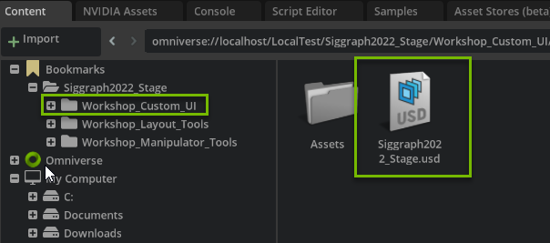
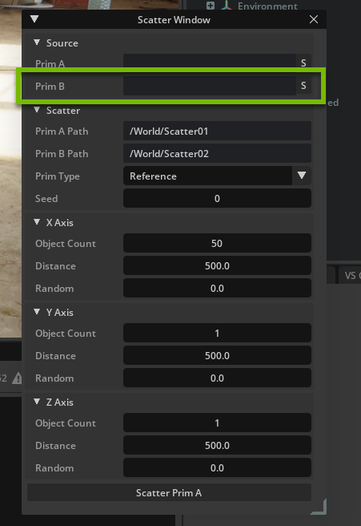

# NVIDIA OMNIVERSE
# Build Beautiful, Custom UI for 3D Tools on NVIDIA Omniverse​

Become a master in UI with a hands-on deep dive into NVIDIA Omniverse Kit’s powerful omni.ui suite of tools and frameworks. In this session, you’ll build your own custom UI for workflows in Omniverse with Python script.

# Learning Objectives
- Enable Extension 
- Build with omni.ui
- Create Columns and Rows
- Create a button

# Omni.ui_Window Scatter

## Step 1: Prepare your Environment

### Step 1.1: Find Bookmarks tab
<br>

Find the `Content` tab at the bottom of the Omniverse Code Console and locate the `Bookmarks` drop down.

### Step 1.2: Open Folder

<br>

In the dropdown, locate the `Siggraph2022_Stage` folder. 

Open the `Workshop_2` folder.

### Step 1.3: Open the Stage

Open `Siggraph2022_Stage.usd`

<br>



### Step 1.4: Open Extension Manager

<br>

Click on `Extensions` Manager Tab 

### Step 1.5: Filter by Commnuity Extension

<br>

Select `Community` tab

### Step 1.6: Search for Widget Info

<br>

Search for `Widget Info` and click on `Omni.example.ui_scene.widget_info`

### Step 1.7: Install/Enable the Extension

<br>

Click on the extension and then click `Install` in the right console. Once installed, enable the extension. 

`Scatter Window` will appear on the screen. 


<br>


<br>


## Challenge: Enable Physics
Find the `Play` button and enable physics to watch what happens.

<details>
<summary>Click here to see where the play button is located</summary>


</details>

<br>

## Challenge: Brainstorm Use Cases
Think of 3 ways this tool could be used. Brain storm with your peers and think of how it can be used for your industry!

<br>

## Step 2: Add another Source

### Step 2.1: Open Visual Studio

Go to the `Extensions` tab and click the `Scatter Window` extension to open the extension overview to the right. Click the `VS Code` icon next to the folder icon:

<br>


<br>

### Step 2.2: Locate Script

Locate the files you need for this session at:

 `exts -> omni/example/ui_scatter_tool`

You are working in

`window.py`

<br>


<br>

### Step 2.3: Create Prim B 

In `ScatterWindow` class there are sets of `Models` and `Defaults` variables. In this we have the variables for Prim A, such as the source and scatter. 

Create a new set for Prim B, as follows:

```python
class ScatterWindow(ui.Window):
    """The class that represents the window"""

    def __init__(self, title: str, delegate=None, **kwargs):
        self.__label_width = LABEL_WIDTH

        super().__init__(title, **kwargs)

        # Models
        self._source_prim_model_a = ui.SimpleStringModel()
        self._scatter_prim_model_a = ui.SimpleStringModel()
        ## NEW PRIM B VARIABLES
        self._source_prim_model_b = ui.SimpleStringModel()
        self._scatter_prim_model_b = ui.SimpleStringModel()
        ## END
        self._scatter_type_model = ComboBoxModel("Reference", "Copy", "PointInstancer")
        self._scatter_seed_model = ui.SimpleIntModel()
        self._scatter_count_models = [ui.SimpleIntModel(), ui.SimpleIntModel(), ui.SimpleIntModel()]
        self._scatter_distance_models = [ui.SimpleFloatModel(), ui.SimpleFloatModel(), ui.SimpleFloatModel()]
        self._scatter_random_models = [ui.SimpleFloatModel(), ui.SimpleFloatModel(), ui.SimpleFloatModel()]

        # Defaults
        self._scatter_prim_model_a.as_string = "/World/Scatter01"
        ## NEW PRIM B VARIABLE
        self._scatter_prim_model_b.as_string = "/World/Scatter02"
        ## END
        self._scatter_count_models[0].as_int = 50
        self._scatter_count_models[1].as_int = 1
        self._scatter_count_models[2].as_int = 1
        self._scatter_distance_models[0].as_float = 500
        self._scatter_distance_models[1].as_float = 500
        self._scatter_distance_models[2].as_float = 500
```
<br>

### Step 2.4: Create the Source Ui

Locate `_build_source` function.

This function creates the Source in the `Scatter Window` Ui using omni.ui to create a column. `ui.VStack`, and rows, `ui.HStack`, as well as the button to set the selection, `ui.Button`. 

Create a new row for Prim B, as so:

```python
    def _build_source(self):
        """Build the widgets of the "Source" group"""
        with ui.CollapsableFrame("Source", name="group"):
            with ui.VStack(height=0, spacing=SPACING):
                with ui.HStack():
                    ui.Label("Prim A", name="attribute_name", width=self.label_width)
                    ui.StringField(model=self._source_prim_model_a)
                    # Button that puts the selection to the string field
                    ui.Button(
                        " S ",
                        width=0,
                        height=0,
                        style={"margin": 0},
                        clicked_fn=lambda:self._on_get_selection(self._source_prim_model_a),
                        tooltip="Get From Selection",
                    )
                ### NEW PRIM B SOURCE ###    
                with ui.HStack():
                    ui.Label("Prim B", name="attribute_name", width=self.label_width)
                    ui.StringField(model=self._source_prim_model_b)
                    # Button that puts the selection to the string field
                    ui.Button(
                        " S ",
                        width=0,
                        height=0,
                        style={"margin": 0},
                        clicked_fn=lambda:self._on_get_selection(self._source_prim_model_b),
                        tooltip="Get From Selection",
                    )
                ### END
```

<br>


This is what your new Ui should look like:



### Step 2.5: Create Scatter Ui

Locate the function `_build_scatter`

This function creates the Ui for the Scatter group below `Source` in `Scatter Window`. 

Create the row for `Prim B Path` below the row for `Prim A Path` as follows:

```python
    def _build_scatter(self):
        """Build the widgets of the "Scatter" group"""
        with ui.CollapsableFrame("Scatter", name="group"):
            with ui.VStack(height=0, spacing=SPACING):
                with ui.HStack():
                    ui.Label("Prim A Path", name="attribute_name", width=self.label_width)
                    ui.StringField(model=self._scatter_prim_model_a)
                ## NEW UI FOR PRIM B
                with ui.HStack():
                    ui.Label("Prim B Path", name="attribute_name", width=self.label_width)
                    ui.StringField(model=self._scatter_prim_model_b)
                ## END
```
<br>

This is what your new Ui should look like:


### Step 2.5: Create the Go button for Prim B

Locate the function `_build_fn`

This function builds the entire Ui in the `Scatter Window` and also calls the function for when the Scatter button is clicked.

We have a button for `Scatter Prim A`.

Create a new button below it to `Scatter Prim B`.

```python
    def _build_fn(self):
        """
        The method that is called to build all the UI once the window is
        visible.
        """
        with ui.ScrollingFrame():
            with ui.VStack(height=0):
                self._build_source()
                self._build_scatter()
                self._build_axis(0, "X Axis")
                self._build_axis(1, "Y Axis")
                self._build_axis(2, "Z Axis")

                # The Go button
                ui.Button("Scatter Prim A", clicked_fn=lambda:self._on_scatter(self._source_prim_model_a, self._scatter_prim_model_a))
                
                ## NEW BUTTON FOR PRIM B
                # The Go button
                ui.Button("Scatter Prim B", clicked_fn=lambda:self._on_scatter(self._source_prim_model_b, self._scatter_prim_model_b))
                ## END
```
<br>

This is what your new Ui should look like:


### Challenge: Set Scale Parameters in the Ui

Can you add the option to set the scale in `Scatter Window`?

<details>
<summary> Click here for the answer </summary>

### Challenge Step 1: Set new variables
Set new variables for scale in `Models` and  `Defaults` of the `ScatterWindow` class of `window.py`

```python
        # Models
        self._source_prim_model_a = ui.SimpleStringModel()
        self._scatter_prim_model_a = ui.SimpleStringModel()
        self._source_prim_model_b = ui.SimpleStringModel()
        self._scatter_prim_model_b = ui.SimpleStringModel()
        self._scatter_type_model = ComboBoxModel("Reference", "Copy", "PointInstancer")
        self._scatter_seed_model = ui.SimpleIntModel()
        self._scatter_count_models = [ui.SimpleIntModel(), ui.SimpleIntModel(), ui.SimpleIntModel()]
        self._scatter_distance_models = [ui.SimpleFloatModel(), ui.SimpleFloatModel(), ui.SimpleFloatModel()]
        self._scatter_random_models = [ui.SimpleFloatModel(), ui.SimpleFloatModel(), ui.SimpleFloatModel()]
        ## NEW SCALE VARIABLE
        self._scale_models = [ui.SimpleFloatModel(), ui.SimpleFloatModel(), ui.SimpleFloatModel()]
        ## END
        

        # Defaults
        self._scatter_prim_model_a.as_string = "/World/Scatter01"
        self._scatter_prim_model_b.as_string = "/World/Scatter02"
        self._scatter_count_models[0].as_int = 50
        self._scatter_count_models[1].as_int = 1
        self._scatter_count_models[2].as_int = 1
        self._scatter_distance_models[0].as_float = 500
        self._scatter_distance_models[1].as_float = 500
        self._scatter_distance_models[2].as_float = 500
        ### NEW SCALE VARIABLES
        self._scale_models[0].as_float = 1
        self._scale_models[1].as_float = 1
        self._scale_models[2].as_float = 1
        ### END
```

### Challenge Step 2: Add scale in _on_scatter
Locate the function `_on_scatter`.

Add scale parameters to `duplicate_prims` as so:

```python
        duplicate_prims(
            transforms=transforms,
            prim_names=prim_names,
            target_path=scatter_model.as_string,
            mode=self._scatter_type_model.get_current_item().as_string,
            ## NEW SCALE PARAMETERS
            scale=[self._scale_models[0].as_float, self._scale_models[1].as_float, self._scale_models[2].as_float]
            ## END
        )
```

### Challenge Step 3: Create the logic in utils.py

#### Step 3.1: Add to duplicate_prims Function
Locate `duplicate_prims` function in `utils.py`. 

Add scale to the parameters as so:

```python
def duplicate_prims(transforms: List = [], prim_names: List[str] = [], target_path: str = "", mode: str = "Copy", scale: List[float] = [1,1,1]):

```
#### Step 3.2: Create New Execture Parameters and Varaibles
Locate `omni.kit.commands.execute` call at the bottom of the script. 

Above this call set new variables for stage, prim, trans_matrix, and new_transform.

```python
            ### NEW VARIABLES ###
            stage = usd_context.get_stage()
            prim = stage.GetPrimAtPath(path_to)
            trans_matrix = matrix[3]
            new_transform = Gf.Vec3d(trans_matrix[0], trans_matrix[1], trans_matrix[2])
            ## END

            omni.kit.commands.execute("TransformPrim", path=path_to, new_transform_matrix=matrix)
            
```

Next, edit and add to the parameters in `omni.kit.commands.exectue`, like so:

```python
            omni.kit.commands.execute("TransformPrimSRT", path=path_to, new_translation=new_transform, new_scale=scale)
```

### Challenge Step 3.3: New Import
At the top of `utils.py` add the new Gf import:

```python
from typing import List
import omni.usd
import omni.kit.commands
from pxr import Sdf
## NEW Gf IMPORT
from pxr import Gf
## END
```


### Challenge Step 4: Build Ui for Scale
Locate `_build_scatter` in `window.py`.

Add a new row for Scale:

```python
    def _build_scatter(self):
        """Build the widgets of the "Scatter" group"""
        with ui.CollapsableFrame("Scatter", name="group"):
            with ui.VStack(height=0, spacing=SPACING):
                with ui.HStack():
                    ui.Label("Prim A Path", name="attribute_name", width=self.label_width)
                    ui.StringField(model=self._scatter_prim_model_a)
                with ui.HStack():
                    ui.Label("Prim B Path", name="attribute_name", width=self.label_width)
                    ui.StringField(model=self._scatter_prim_model_b)
                    
                with ui.HStack():
                    ui.Label("Prim Type", name="attribute_name", width=self.label_width)
                    ui.ComboBox(self._scatter_type_model)
                with ui.HStack():
                    ui.Label("Seed", name="attribute_name", width=self.label_width)
                    ui.IntDrag(model=self._scatter_seed_model, min=0, max=10000)
                
                ### NEW ROW FOR SCALE ###
                with ui.HStack():
                    ui.Label("Scale", name="attribute_name", width=self.label_width)
                    for field in zip(["X:", "Y:", "Z:"], self._scale_models):
                        ui.Label(field[0], width=0, style={"margin": 3.0})
                        ui.FloatField(model=field[1], height=0, style={"margin": 3.0})
                ## END 
```

This is what your new Ui should look like:


</details>

<br>

## Step 3: Make your scene

### Step 3.1: Play!

Play around in your scene and scatter your prims. 

>:bulb:Press play when you are finished


### Challenge: How many marbles can you get in the jars and bowls?

How can you use the scatter tool to drop as many marbles into the jars and bowls?

<details>
<summary>Click here for the answer</summary>

Scatter a Prim in a smaller distance to create a large stack of prims then move over a jar or bowl before pressing play. Then watch them all fall!


</details>

<br>

## Congratulations! 
You have completed this workshop! We hope you have enjoyed learning and playing in Omniverse!

[Join us on Discord to extend the conversation!](https://discord.gg/BVFQEeXe)