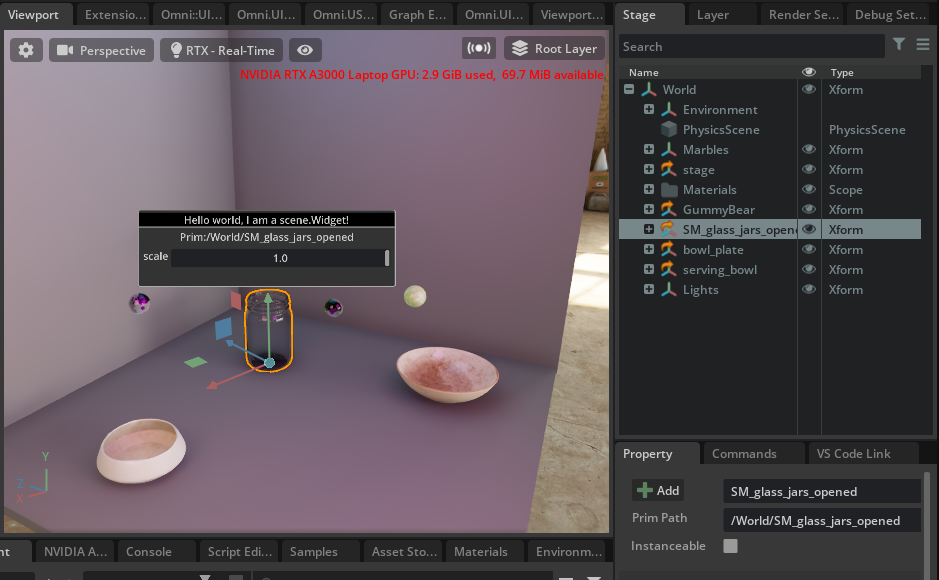
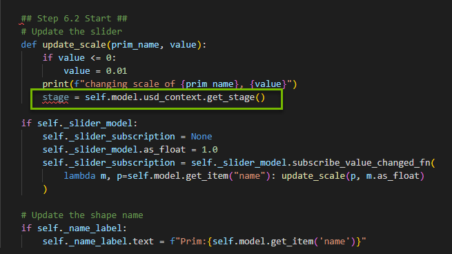
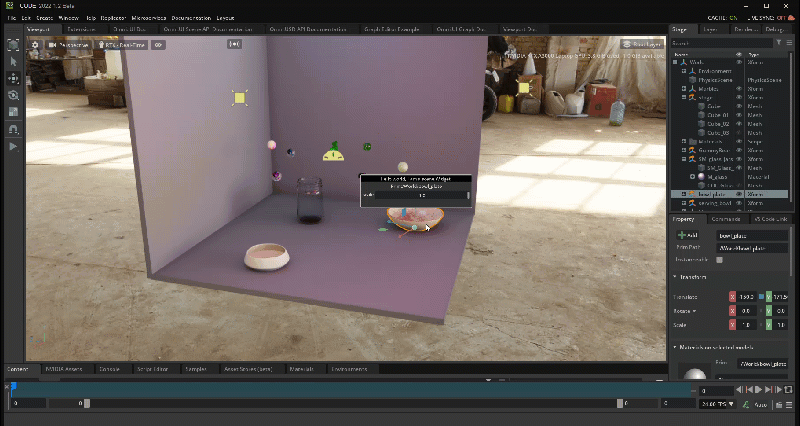

# NVIDIA OMNIVERSE
# How to Build Custom 3D Scene Manipulator Tools on NVIDIA Omniverse

See how you can build advanced tools on the modular, easily extensible Omniverse platform. You’ll learn from the Omniverse developer ecosystem team how you can extend and enhance the 3D tools you know and love today.​

# Learning Objectives
- Enable Extension
- Attach `scale` function to Slider Widget


# Ui Scene_Widget Info

## Section I

### Step 1: Open the Workshop Stage

>#### <b>Step 1.1: Open the Bookmarks Tab</b>

Find the `Content` tab at the bottom of the Omniverse Code Console and locate the `Bookmarks` drop down.

>#### <b>Step 1.2: Get our Project File</b>
In the dropdown,
-  Locate the `Siggraph2022_Stage` folder. 

- Open the `Workshop_Manipulator_Tools` folder.

- Open `Siggraph2022_Stage.usd`

<br>


<br>

### Step 2: Install the Widget Extension
> #### <b>Step 2.1: Open the Extensions Tab</b>
Click on `Extensions` Manager Tab 

>#### <b>Step 2.2: Filter by Commnuity Extension</b>

Select `Community` tab
<br>


<br>

>#### <b>Step 2.3: Search for Widget Info</b>

Search for `Widget Info` and click on `Omni UI Scene Object Info With Widget Example`


>#### <b>Step 2.4: Install/Enable the Extension</b>

Click on the extension and then click `Install` in the right console. Once installed, enable the extension. 

>:exclamation: You may get a warning that this extension is not verified. It is safe to install this extension.

<br>

>#### <b>Step 2.5: Check that the Widget is Working</b>

Navigate to `Viewport` then select a `prim` in the hierarchy. 

A `prim` is short for primitive. The prim is the fundamental unit in Omniverse. Anything imported or created in a `USD`, Universal Scene Description, scene. This includes camera, sounds, lights, meshes, etc. 

You should see the following widget appear in the viewport above the `prim`:

<br>



<br>

>:question: Did you notice?
>- The path of the prim is displayed in the widget.
>- There is a scale slider in the widget but it doesn't work! We will fix this in the next section.

<br>

>#### <b>Step 3: Find the Play Button</b>
Locate the `Play` button in the viewport and see what happens when you click it! Don't forget to hit the `Stop` button when you are finished.
<details>
<summary>Click here to see where the button is located </summary>


</details>

<br>

>#### :bell:<b>Challenge Step 4: Brainstorm Use Cases</b>
>Think of 3 ways a widget could be used. For example, you noticed that the path of the prim is displayed, what else could you display about the prim in the widget? Brain storm with your peers and think of how it can be used for your industry! We will have a group discussion about this later on.

<br>

<br>

>### :no_entry_sign: Stop here and wait to move on to Section II

<br>

## Section II

### Step 5: Find your Work Files

>#### <b>Step 5.1: Open Visual Studio</b>

Go to the `Extensions` tab.

Click the `Widget Info` extension to open the extension overview to the right. 

Click the `VS Code` icon next to the folder icon:

<br>


<br>

`VS Code` will pop up separately and look like this:


<br>


>#### <b>Step 5.2: Locate Manipulator Script</b>

Locate the files you need for this session in the left column drop-down menus at:

 `exts -> omni.example.ui_scene.widget_info\omni\example\ui_scene\widget_info`

You are working in

`widget_info_manipulator.py`

<br>


<br>

### Step 6: Fix the Broken Slider
>#### Step 6.1: Add a New Import

Locate the `imports` at the top of the script.

Add the new import:

```python
from pxr import Gf
```

The imports will now look like this:


<br>

In the variables you will set in the following steps, you will be making a call to `Graphics Foundation`, Gf, which is a package that defines classes for fundamental graphics types and operations.

>#### <b>Step 6.2: Find the Function Update_Scale</b>

Locate the following function at the bottom of the script:

```python
         # Update the slider
        def update_scale(prim_name, value):
```

This function updates the slider in the Widget. However, it currently does not have any logic to update the scale. Let's start adding the code we need to get that working!

>#### <b>Step 6.3: Get the Current Stage</b>

Inside of `update_scale` function, find the `print` call.

Define the `stage` variable underneath this call, like so:

```python
            stage = self.model.usd_context.get_stage()
```

This stage variable will use USD to get the current stage. 

The `Stage` is where your prims are nested in the hierarchy. 


So now, `update_scale` should look like this:



<br>

>:exclamation: Make sure your new stage variable is lined up with the print call. If it is not, add or delete tabs until it is.

<br>

>#### <b>Step 6.4: Get the Selected Prim</b>

Next, add a variable underneath the stage variable for the currently selected prim:

```python
            prim = stage.GetPrimAtPath(self.model._current_path)
```

`update_scale` will now look like this:


>:exclamation: This prim variable should be lined up with the stage and print call above it.

<br>

>#### <b>Step 6.5: Update the Scale </b>

Add the variable for the scale on the next line.

 In this variable you will get the scale `attribute` of the `xform` and the scale's Vector3 value, like so:

```python
            scale = prim.GetAttribute("xformOp:scale")
            scale.Set(Gf.Vec3d(value, value, value))
```

Now, your completed `update_scale` function will look like this:


>:exclamation: The scale variable should be lined up with the variables above it.

<br>

### Step 7: Did it work?
> #### <b>Step 7.1: Save and Test! </b>
Save your manipulator script and check that the scale slider works in your widget! 

>:exclamation: When you save, you may notice that the widget disappears in the viewport. This is to be expected, click the prim again to show the widget. 



Your slider is now being udpated by the function `update_scale`, where you added properties that grab the `Stage` and the currently selected `prim` that the widget is displayed on, then calls the scale vector3 when the slider is moved to scale the prim in all directions.

>:exclamation: Not Working? Check the `Console` to debug any errors.
>
>

<br>

>#### :bell:<b>Challenge Step 8: Scale Larger</b>
>
>Can you change the function to scale the prim larger than by 1.0?
>
><details>
><summary> Click here for the answer </summary>
>
>Set a `value` variable and multiply value by a number of your choice. We did the following:
>
>```python
>        def update_scale(prim_name, value):
>            if value <= 0:
>                value = 0.01
>            print(f"changing scale of {prim_name}, {value}")
>            ## NEW VALUE VARIABLE
>            value = 10*value
>            stage = self.model.usd_context.get_stage()
>            prim = stage.GetPrimAtPath(self.model._current_path)
>            scale = prim.GetAttribute("xformOp:scale")
>            scale.Set(Gf.Vec3d(value, value, value))
>        if self._slider_model:      
>            self._slider_subscription = None
>            self._slider_model.as_float = 1.0
>            self._slider_subscription = self._slider_model.subscribe_value_changed_fn(
>                lambda m, p=self.model.get_item("name"): update_scale(p, m.as_float)
>            )
>```
>
></details>

<br>

>#### :bell:<b>Challenge Step 9: What other properties might you want to control with the widget?</b>
> Brainstorm 3-5 other properties that you could add to this widget. We will have an open discussion later on.

<br>

>### :no_entry_sign: Stop here and wait to move on to Section III

<br>

## Section III:

### Step 10: Create your scene

>#### <b>Step 10.1: Scale Everything!</b>

Play around in your scene and scale the prims in various sizes, such as a very large marble or a tiny jar. 

How can you make your scene unique?

>:bulb: Press the `Play` button when you are finished!
>
>

<br>


<br>

>#### :bell:<b>Challenge Step 11: Scale in One Axis</b>
>
>Can you change the function to scale the prim in only one axis?
>
><details>
><summary> Click here for the answer </summary>
>
>Set a number for any value inside of `scale.Set(Gf.Vec3d(value,value,value))`
>
>For example:
>
>```python
>scale.Set(Gf.Vec3d(1,value,value))
>```
>
>Which, would change the scale in the X axis.
>
></details>

<br>

>#### :bell:<b>Challenge Step 12: Turn on the Light Manipulator</b>
>Turn on the Light Manipulator Extension and click on the Rect Light.
>
>How can you change the intensity of the light using the tool?
>
><details>
><summary>Click here for the answer</summary>
>
>In the `Extensions` tab, search for Light in the `Community` and install/enable the `Omni.Ui Scene Sample for Manipulating Select Light` extension.
>
>
>
><br>
>
>Select one of the Rect Lights in the hierarchy. 
>
>
>
><br>
>
>Use your cursor to grab the edges of the Light tool and change the intensity by dragging forward or backward.
>
>
>
></details>

<br>


## Congratulations!
You have completed this workshop! We hope you have enjoyed learning and playing with Omniverse! 

[](https://www.nvidia.com/en-us/omniverse/apps/code/developer-contest/)

[Join us on Discord to extend the conversation!](https://discord.gg/BVFQEeXe)