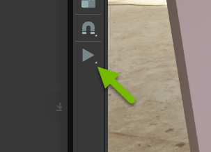
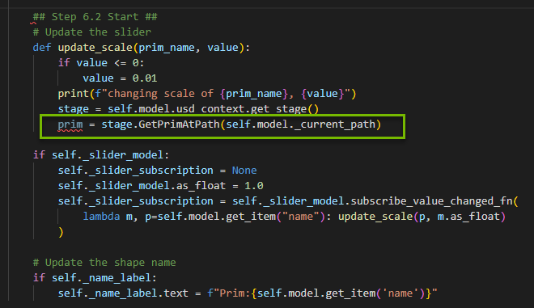
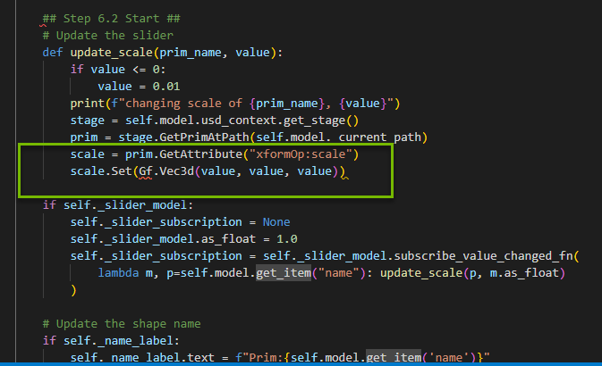

# NVIDIA OMNIVERSE
# How to Build Custom 3D Scene Manipulator Tools on NVIDIA Omniverse

See how you can build advanced tools on the modular, easily extensible Omniverse platform. You’ll learn from the Omniverse developer ecosystem team how you can extend and enhance the 3D tools you know and love today.​

# Learning Objectives
- Enable Extension
- Attach `scale` function to Slider Widget


# Ui Scene_Widget Info

## Section 1

### Step 1: Get the Stage Opened

>#### <b>Step 1.1: Open the Bookmarks Tab</b>

Find the `Content` tab at the bottom of the Omniverse Code Console and locate the `Bookmarks` drop down.

>#### <b>Step 1.2: Get our Project File</b>
In the dropdown,
-  locate the `Siggraph2022_Stage` folder. 

- Open the `Workshop_2` folder.

- Open `Siggraph2022_Stage.usd`

<br>


<br>

### Step 2: Install the Widget Extension
> #### <b>Step 2.1: Open the Extensions Tab</b>
Click on `Extensions` Manager Tab 

>#### <b>Step 2.2: Filter by Commnuity Extension</b>

Select `Community` tab
<br>


<br>

>#### <b>Step 2.3: Search for Widget Info</b>

Search for `Widget Info` and click on `Omni.example.ui_scene.widget_info`

>#### <b>Step 2.4: Install/Enable the Extension</b>

Click on the extension and then click `Install` in the right console. Once installed, enable the extension. 

>:exclamation: You may get a warning that this extension is not verified. It is safe to install this extension.

<br>

>#### <b>Step 2.5: Check that the Widget is Working</b>

Navigate to `Viewport` then select a `prim` in the hierarchy. You should see the following widget appear in the viewport above the `prim`:

<br>


<br>

Notice the path of the prim is displayed and that the widget nests a scale slider. Also notice that the scale slider doesn't work but don't worry, we will fix this in the next section!

>#### :bell:Challenge: Brainstorm Use Cases
>Think of 3 ways this tool could be used. Brain storm with your peers and think of how it can be used for your industry!

<br>

>#### :bell:Challenge: Find the Play Button
>Locate the Play button in the viewport and see what happens when you click it!!
><details>
><summary>Click here to see where the button is located </summary>
>
>
>
></details>

<br>

>### :no_entry_sign: Stop here and wait to move on to Section 2

<br>

## Section 2

### Step 3: Find your Work Files

>#### <b>Step 3.1: Open Visual Studio</b>

Go to the `Extensions` tab and click the `Widget Info` extension to open the extension overview to the right. Click the `VS Code` icon next to the folder icon:

<br>


<br>

>#### <b>Step 3.2: Locate Manipulator Script</b>

Locate the files you need for this session at:

 `exts -> omni/example/ui_scene/widget_info`

You are working in

`widget_info_manipulator.py`

<br>


<br>

### Step 4: Fix the Broken Slider
>#### <b>Step 4.1: Find the Function Update_Scale</b>

Locate the following function at the bottom of the script:

```python
        def update_scale(prim_name, value):
```

This function updates the slider in the Widget. However, it currently does not have any logic to update the scale. Let's start adding the code we need to get that working!

>#### <b>Step 4.2: Get the Current Stage</b>

Inside of `update_scale` function, find the `print` call.

Underneath this call we will create the variable for the stage. This stage variable will use USD to get the current stage. 

The `Stage` is where your prims are nested in the hierarchy. 

The variable will be defined as so:

```python
            stage = self.model.usd_context.get_stage()
```

So now, `update_scale` should look like this:


<br>

>#### <b>Step 4.3: Get the Selected Prim</b>

Next, add a variable for the currently selected prim on the stage with the line:

```python
            prim = stage.GetPrimAtPath(self.model._current_path)
```

`update_scale` will now look like this:




<br>

>#### <b>Step 4.4: Update the Scale </b>

Add the variable for the scale, where you will get the scale `attribute` of the `xform` and the scale's Vector3 value, like so:

```python
            scale = prim.GetAttribute("xformOp:scale")
            scale.Set(Gf.Vec3d(value, value, value))
```

Now, your completed `update_scale` function will look like this:



<br>

>### <b>Step 4.5: Import Gf from pxr</b>

In the scale variable we made a call to the `Graphics Foundation`, Gf, which is a package that defines classes for fundamental graphics types and operations.

At the top of the manipulator script, add the import as so:

```python
from pxr import Gf
```

### Step 5: Did it work?
> #### <b>Step 5.1: Save and Play! </b>
Save your manipulator script and check that the scale slider works in your widget!


>#### :bell:Challenge: Scale in larger increments
>
>Can you change the function to scale the prim in larger increments?
>
><details>
><summary> Click here for the answer </summary>
>
>Set a `value` variable and multiply value by a number of your choice. We did the >following:
>
>```python
>        def update_scale(prim_name, value):
>            print(f"changing scale of {prim_name}, {value}")
>            ## NEW VALUE VARIABLE
>            value = 10*value
>            stage = self.model.usd_context.get_stage()
>            prim = stage.GetPrimAtPath(self.model._current_path)
>            scale = prim.GetAttribute("xformOp:scale")
>            scale.Set(Gf.Vec3d(value, value, value))
>        if self._slider_model:      
>            self._slider_subscription = None
>            self._slider_model.as_float = 1.0
>            self._slider_subscription = self._slider_model.subscribe_value_changed_fn(
>                lambda m, p=self.model.get_item("name"): update_scale(p, m.as_float)
>            )
>```
>
></details>

<br>

>#### :bell:Challenge: What other properties might you want to control with the widget?
> Brainstorm 3-5 other properties that you could add to this widget.

<br>

>### :no_entry_sign: Stop here and wait to move on to Section 3

<br>

## Section 3:

### Step 6: Create your scene

>#### <b>Step 3.1: Scale Everything!</b>

Play around in your scene and scale the prims in various sizes, such as a very large marble or a tiny jar. 

How can you make your scene unique?

>:bulb: Press the `Play` button when you are finished!
>
>

<br>


<br>

>#### :bell:Challenge: Scale in One Axis
>
>Can you change the function to scale the prim in only one axis?
>
><details>
><summary> Click here for the answer </summary>
>
>Set a number for any value inside of `scale.Set(Gf.Vec3d(value,value,value))`
>
>For example:
>
>```python
>scale.Set(Gf.Vec3d(1,value,value))
>```
>
>Which, would change the scale in the X axis.
>
></details>

<br>

>#### :bell:Challenge: Turn on the Light Manipulator
>Turn on the Light Manipulator Extension and click on the Rect Light.
>
>How can you change the intensity of the light using the tool?
>
><details>
><summary>Click here for the answer</summary>
>
>In the `Extensions` tab, search for Light in the `Community` and install/enable the `Omni.Ui Scene Sample for Manipulating Select Light` extension.
>
>
>
><br>
>
>Select one of the Rect Lights in the hierarchy. 
>
>
>
><br>
>
>Use your cursor to grab the edges of the Light tool and change the intensity by dragging forward or backward.
>
>
>
></details>

<br>


## Congratulations!
You have completed this workshop! We hope you have enjoyed learning and playing with Omniverse! 

[](https://www.nvidia.com/en-us/omniverse/apps/code/developer-contest/)

[Join us on Discord to extend the conversation!](https://discord.gg/BVFQEeXe)