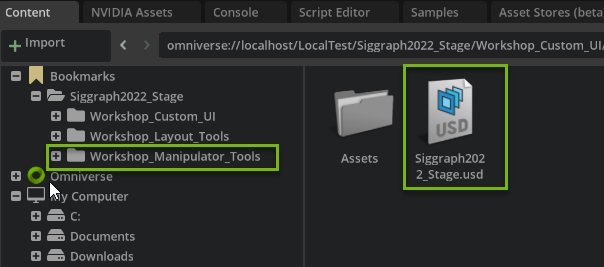

# NVIDIA OMNIVERSE
# How to Build Custom 3D Scene Manipulator Tools on NVIDIA Omniverse

See how you can build advanced tools on the modular, easily extensible Omniverse platform. You’ll learn from the Omniverse developer ecosystem team how you can extend and enhance the 3D tools you know and love today.​

# Learning Objectives
- Enable Extension
- Attach `scale` function to Slider Widget


# Ui Scene_Widget Info

## Step 1: Prepare your Environment

### Step 1.1: Find Bookmarks tab
<br>

Find the `Content` tab at the bottom of the Omniverse Code Console and locate the `Bookmarks` drop down.

### Step 1.2: Open Folder

<br>

In the dropdown, locate the `Siggraph2022_Stage` folder. 

Open the `Workshop_2` folder.

### Step 1.3: Open the Stage

Open `Siggraph2022_Stage.usd`

<br>



### Step 1.4: Open Extension Manager

<br>

Click on `Extensions` Manager Tab 

### Step 1.5: Filter by Commnuity Extension

<br>

Select `Community` tab

### Step 1.6: Search for Widget Info

<br>

Search for `Widget Info` and click on `Omni.example.ui_scene.widget_info`

### Step 1.7: Install/Enable the Extension

<br>

Click on the extension and then click `Install` in the right console. Once installed, enable the extension. 

<br>


<br>

### Step 1.8: Check in Viewport

Navigate to `Viewport` then select a `prim` in the hierarchy. You should see the following widget appear in the viewport above the `prim`:

<br>


<br>

## Challenge: Brainstorm Use Cases
Think of 3 ways this tool could be used. Brain storm with your peers and think of how it can be used for your industry!

<br>

## Step 2: Add Scale Function to Slider

### Step 2.1: Open Visual Studio

Go to the `Extensions` tab and click the `Widget Info` extension to open the extension overview to the right. Click the `VS Code` icon next to the folder icon:

<br>


<br>

### Step 2.2: Locate Script

Locate the files you need for this session at:

 `exts -> omni/example/ui_scene/widget_info`

You are working in

`widget_info_manipulator.py`

<br>


<br>

### Step 2.3: Update Function

Locate the following function at the bottom of the script:

```python
        def update_scale(prim_name, value):
```

This function updates the slider in the Widget. However, it currently does not have any logic to update the scale. 

Update the function as follows to create the logic for scaling the prim:

```python
        # Update the slider
        def update_scale(prim_name, value):
            print(f"changing scale of {prim_name}, {value}")
            ## NEW LOGIC TO SCALE PRIM
            stage = self.model.usd_context.get_stage()
            prim = stage.GetPrimAtPath(self.model._current_path)
            scale = prim.GetAttribute("xformOp:scale")
            scale.Set(Gf.Vec3d(value, value, value))
            ## END
        if self._slider_model:      
            self._slider_subscription = None
            self._slider_model.as_float = 1.0
            self._slider_subscription = self._slider_model.subscribe_value_changed_fn(
                lambda m, p=self.model.get_item("name"): update_scale(p, m.as_float)
            )

        # Update the shape name
        if self._name_label:
            self._name_label.text = f"Prim:{self.model.get_item('name')}"
```

Save the script and check that the slider works in Omniverse.

## Challenge: Scale in Larger Increments

Can you change the function to scale the prim in larger increments?

<details>
<summary> Click here for the answer </summary>

Set a `value` variable and multiply value by a number of your choice. We did the following:

```python
        def update_scale(prim_name, value):
            print(f"changing scale of {prim_name}, {value}")
            ## NEW VALUE VARIABLE
            value = 10*value
            stage = self.model.usd_context.get_stage()
            prim = stage.GetPrimAtPath(self.model._current_path)
            scale = prim.GetAttribute("xformOp:scale")
            scale.Set(Gf.Vec3d(value, value, value))
        if self._slider_model:      
            self._slider_subscription = None
            self._slider_model.as_float = 1.0
            self._slider_subscription = self._slider_model.subscribe_value_changed_fn(
                lambda m, p=self.model.get_item("name"): update_scale(p, m.as_float)
            )
```

</details>

<br>

## Step 3: Scale Objects in Scene

### Step 3.1: Play!

Play around in your scene and scale the prims in various sizes, such as a very large marble or a tiny jar. 

How can you make your scene unique?

>:bulb: Press the `Play` button when you are finished!


<br>


<br>

## Challenge: Scale in One Axis

Can you change the function to scale the prim in only one axis?

<details>
<summary> Click here for the answer </summary>

Set a number for any value inside of `scale.Set(Gf.Vec3d(value,value,value))`

For example:

```python
scale.Set(Gf.Vec3d(1,value,value))
```

Which, would change the scale in the X axis.

</details>

<br>

## Challenge: Turn on the Light Manipulator
Turn on the Light Manipulator Extension and click on the Rect Light.

How can you change the intensity of the light using the tool?

<details>
<summary>Click here for the answer</summary>

In the `Extensions` tab, search for Light in the `Community` and install/enable the `Omni.Ui Scene Sample for Manipulating Select Light` extension.


<br>

Select one of the Rect Lights in the hierarchy. 


<br>

Use your cursor to grab the edges of the Light tool and change the intensity by dragging forward or backward.


</details>

<br>


## Congratulations!
You have completed this workshop! We hope you have enjoyed learning and playing with Omniverse! 

[Join us on Discord to extend the conversation!](https://discord.gg/BVFQEeXe)